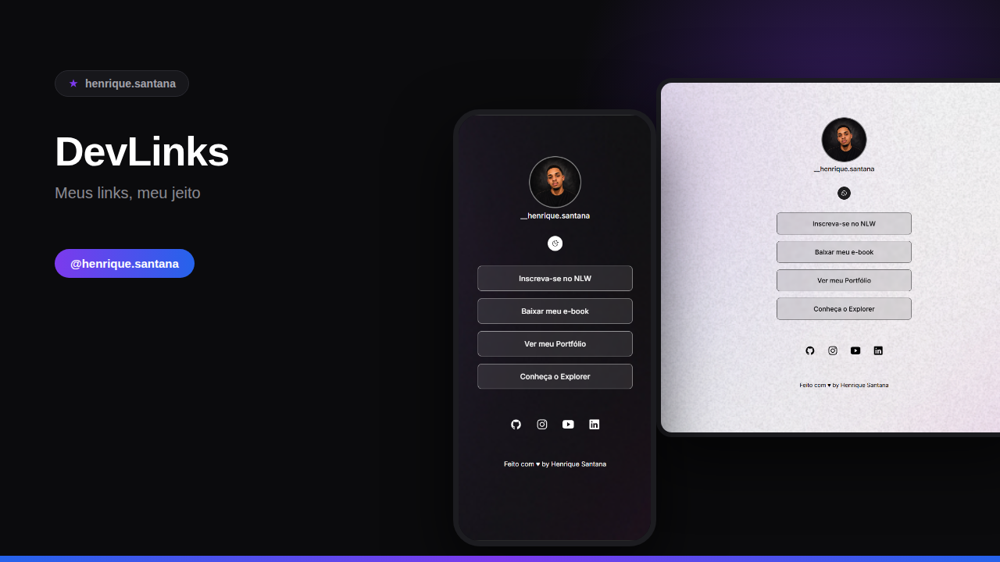

# DevLinks



Página pessoal estilo "link in bio" (Linktree), com alternância entre tema claro e escuro.

## 🔗 Demonstração

Abra o arquivo `index.html` no navegador ou rode com o Live Server do VS Code.

## ✨ Funcionalidades

- Perfil com foto, nome de usuário e links personalizados
- Botão de alternância entre modo **dark** e **light**, com transição suave e preferência salva no navegador (`localStorage`)
- Ícones de redes sociais (GitHub, Instagram, YouTube, LinkedIn)
- Layout responsivo (mobile e desktop)

## 🛠️ Tecnologias

- HTML5
- CSS3 (variáveis CSS, transições, media queries)
- JavaScript (manipulação de classes e `localStorage`)
- [Ionicons](https://ionic.io/ionicons) para os ícones de redes sociais

## 📁 Estrutura de pastas

```
├── assets/
│   ├── avatar.png
│   ├── bg-mobile.jpg
│   └── bg-mobile-light.jpg
├── index.html
├── style.css
├── script.js
└── README.md
```

## ▶️ Como executar

1. Clone ou baixe este repositório.
2. Certifique-se de que a pasta `assets/` está no mesmo diretório do `index.html`.
3. Abra o `index.html` diretamente no navegador, ou use a extensão **Live Server** do VS Code para rodar com hot reload.

## 🎨 Personalização

- **Links:** edite os itens da lista `<ul>` no `index.html`.
- **Redes sociais:** edite os links dentro de `#social-links`.
- **Cores do tema:** ajuste as variáveis CSS em `:root` (modo dark) e `.light` (modo light) no `style.css`.

## 👤 Autor

Henrique Santana
- [GitHub](https://github.com/henrique-santana)
- [Instagram](https://www.instagram.com/__henrique.sant/)
- [LinkedIn](https://www.linkedin.com/in/henrique-santana-dev/)
